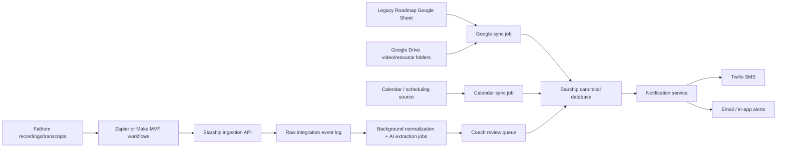

# Integrations And Automation Best Practices For Starship

Research Agent 2 output. Created 2026-07-08.

## Scope

This brief covers the integration and automation layer implied by `planning/requirements-transcript.md`:

- Fathom recording, transcript, AI summary, and action-item ingestion.
- Google Sheets and Drive ingestion for the Legacy Roadmap workbook and video/resource library.
- SMS reminders and action-item delivery.
- Coach and client notification workflows.
- Calendar and pre-call workflows.
- Webhook/API design patterns.
- Zapier/Make-style MVP options versus a custom integration layer.

## Executive Recommendation

Use a hybrid integration strategy:

1. Start the MVP with Zapier or Make for non-critical ingestion paths, especially Fathom to Google Docs/Drive, Fathom action items to an app webhook, and simple reminder experiments.
2. Build Starship's own canonical data model and ingestion API immediately, even if Zapier/Make feeds it at first.
3. Move high-value, privacy-sensitive, high-volume, or stateful workflows into custom code once the schemas stabilize: transcript intelligence, roadmap progress sync, SMS consent and delivery, client notifications, and calendar-driven weekly trackers.
4. Treat every third-party integration as asynchronous and replayable: store raw source payloads, normalize them into Starship records, deduplicate by external IDs, and process long-running AI extraction in background jobs.

This protects the project from a common MVP trap: automations move data around quickly, but no durable product brain forms underneath them. Starship should use automation platforms as scaffolding, not as the source of truth.

## Requirement Mapping

| Starship requirement | Recommended integration pattern | MVP option | Custom-build target |
| --- | --- | --- | --- |
| Pull key insights from Fathom recordings | Fathom trigger/export to webhook, store transcript and source metadata, run AI extraction job | Zapier templates for new Fathom transcripts/summaries | Direct API/webhook if Fathom exposes required access; otherwise controlled export pipeline |
| Track Fathom action items and text clients | Ingest action items as tasks, require owner/due date/confidence, send SMS through consent-aware messaging service | Zapier Fathom action-item trigger to Starship webhook/Twilio | Native task extraction, review queue, Twilio Messaging Service |
| Legacy Roadmap Google Sheet ingestion | Google OAuth, Sheets read batches, Drive change notifications, sync tokens/checkpoints | Manual import or scheduled Zapier/Make sync | Dedicated Google Workspace connector with incremental sync |
| Weekly tracker/pre-call questions | Calendar-aware scheduled reminders and form/task state | Zapier/Make scheduled workflow | Native scheduler with quiet hours, retries, and per-client cadence |
| Coach alerted on completed assignment | Internal event emitted when assignment status changes; notification preferences route it | Email/Slack/SMS via automation | Native notification service with digest and real-time options |
| Video/framework library | Google Drive folder ingest with metadata, permissions, tags, and topic mapping | Link curated Drive folders in Starship | Asset/resource catalog with Drive or hosted video provider integration |

## Fathom Recording And Transcript Ingestion

### What Current Integration Surfaces Suggest

Fathom has publicly listed Zapier integration templates for workflows directly relevant to Starship: creating Google Docs from new Fathom transcripts, uploading recordings/transcripts to Google Drive, creating Notion records from AI summaries, posting summaries to Slack, and creating Asana tasks for new action items. Source: [Zapier Fathom integrations](https://zapier.com/apps/fathom/integrations).

That strongly suggests the practical MVP path is not to wait for a perfect direct Fathom API. Use Fathom's existing automation triggers where available, then normalize those payloads into Starship.

### Best Practices

- Store the raw Fathom artifact separately from the interpreted artifact.
  - Raw: meeting ID, recording URL, transcript text, Fathom summary, Fathom action items, participants, meeting time, source export timestamp.
  - Interpreted: Starship insights, internal-world insights, external-world insights, roadmap updates, action items, suggested resources, confidence, reviewed/approved status.

- Make transcript ingestion idempotent.
  - Use a unique source key such as `provider=fathom`, `external_meeting_id`, `recording_url`, or a stable transcript document ID.
  - If Fathom/Zapier does not expose a durable meeting ID, compute a hash from meeting title, start time, organizer, and transcript content.

- Separate "extract" from "publish."
  - Extraction can use AI to propose insights and action items.
  - Publishing should require either clear confidence thresholds or coach review before clients receive texts.

- Process long transcripts in sections before producing final synthesis.
  - Meeting summarization research increasingly favors sectioned/topic-based processing for long transcripts so action items do not get lost in a single broad summary. Source: [Action-Item-Driven Summarization of Long Meeting Transcripts](https://arxiv.org/abs/2312.17581).

- Preserve timestamps and speaker attribution where possible.
  - Starship will need explainability: "why did the system say this is a roadmap update?"
  - Every extracted insight or action item should point back to transcript timestamp, speaker, and source excerpt when available.

### Starship-Specific Extraction Schema

Recommended normalized records:

- `CallRecording`: client, coach, call date, provider, external ID, recording URL, transcript URL, source status.
- `TranscriptSegment`: call, start/end timestamp, speaker, text, topic label.
- `CallInsight`: call, client, category `internal_world | external_world | roadmap | thought_model | risk | win`, title, summary, evidence references, confidence, review status.
- `ActionItem`: call, client, owner, action text, due date, source, evidence references, status, notification status.
- `RoadmapUpdateCandidate`: call, client, dimension/worksheet/metric, previous value, proposed value, rationale, review status.

### Anti-Patterns

- Do not send every extracted action item directly to the client without review at first.
- Do not make Fathom the source of truth for tasks. Fathom is the source of the call artifact; Starship owns the task lifecycle.
- Do not discard raw transcripts after summarization. Summaries are not auditable enough for coaching progress, disputes, or later model improvements.
- Do not rely only on meeting titles to match clients. Use participant email, calendar event, coach-selected client, and/or manual review for ambiguous matches.

## Google Sheets And Drive: Legacy Roadmap Ingestion

### Best Practices

- Use Google OAuth with least-privilege scopes.
  - Prefer file-specific permissions through Google Picker or user-selected files over full-drive access.
  - Store refresh tokens securely and support revocation/reconnect.

- Treat the Legacy Roadmap workbook as an external source with versioned snapshots.
  - Starship should import values into a canonical `RoadmapSnapshot` model.
  - Keep the source spreadsheet ID, tab name, range, row/column mapping, and import timestamp.

- Read Sheets in batches and respect quota behavior.
  - Google Sheets recommends keeping payloads around 2 MB for speed.
  - Sheets has per-minute quotas, including 300 read requests per minute per project and 60 per minute per user per project; quota errors should use truncated exponential backoff. Source: [Google Sheets API usage limits](https://developers.google.com/workspace/sheets/api/limits).

- Use Drive change notifications or scheduled sync plus checksums depending on MVP complexity.
  - Google Drive push notifications can notify Starship when a watched file or change log changes, reducing polling. Source: [Google Drive push notifications](https://developers.google.com/workspace/drive/api/guides/push).
  - Drive notification channels require HTTPS callback URLs, stable channel IDs, resource tracking, token verification, and renewal because channels expire.

- Keep spreadsheet structure mapping explicit.
  - Create an admin mapping screen or config file that maps workbook tabs/ranges to Starship concepts.
  - Avoid hard-coding row numbers if coaches may edit the workbook.

### Recommended Sync Flow

1. Coach connects Google account and selects the Legacy Roadmap Sheet.
2. Starship stores the spreadsheet ID and an explicit import mapping.
3. Initial import reads configured ranges and creates a `RoadmapSnapshot`.
4. A Drive watch or scheduled sync checks for changes.
5. Starship imports changed ranges, validates shape, computes deltas, and stores a new snapshot.
6. Progress UI reads from Starship snapshots, not directly from Sheets.

### Anti-Patterns

- Do not read the live Google Sheet every time a client opens progress tracking.
- Do not assume one workbook layout forever.
- Do not use broad Drive access if the product only needs one workbook and a resource folder.
- Do not update client-facing progress automatically from malformed sheets without validation and audit trails.

## Google Drive Video And Resource Library

### Best Practices

- Start with Drive as a metadata/source repository, not as the app's long-term video experience.
  - In MVP, Starship can index Drive folders containing framework/cosmology recordings.
  - Later, move to a video host with proper streaming, access control, captions, analytics, and topic tagging if usage grows.

- Store library metadata in Starship.
  - Title, description, topic tags, framework/cosmology category, audience/visibility, Drive file ID, thumbnail URL, transcript/caption link if available, related roadmap stage.

- Build a topic taxonomy early.
  - The requirement says clients should be "pointed to different topics." This needs consistent tags and recommendation rules, not just a folder list.

- Sync Drive metadata by file ID.
  - Google Drive resource IDs are stable; URLs and names can change.
  - Use Drive change events or scheduled sync to detect new/renamed videos.

### Anti-Patterns

- Do not expose raw Drive folder sprawl as the main client library.
- Do not depend on file names alone for topic classification.
- Do not duplicate large video files into the app before access, cost, and streaming requirements are known.

## SMS Reminders And Action-Item Delivery

### Best Practices

- Use Twilio Messaging Services rather than sending from scattered individual numbers.
  - Twilio Messaging Services provide sender pools, callbacks, compliance features, and configuration for opt-in/opt-out handling. Source: [Twilio Advanced Opt-Out](https://www.twilio.com/docs/messaging/tutorials/advanced-opt-out).

- Complete required US messaging registration before production SMS.
  - For US recipients, Twilio documents A2P 10DLC registration requirements for long-code business texting. Source: [Twilio SMS sending guide](https://www.twilio.com/docs/messaging/tutorials/how-to-send-sms-messages).

- Capture explicit SMS consent.
  - Store phone number, consent timestamp, consent source, message category, opt-out status, and last confirmation.
  - Support STOP/START/HELP behavior and visible unsubscribe language.

- Keep SMS content minimal and privacy-conscious.
  - Send reminders and links to the secure Starship app rather than sensitive journal content or deeply personal call insights.
  - Example: "You have 2 Starship action items from today's call. Review them here: [secure link]. Reply STOP to opt out."

- Use delivery status callbacks.
  - Twilio supports inbound webhooks and outbound status callbacks; Starship should record queued, sent, delivered, failed, undelivered, and opt-out events. Sources: [Twilio webhook requests](https://www.twilio.com/docs/messaging/guides/webhook-request), [Twilio SMS sending guide](https://www.twilio.com/docs/messaging/tutorials/how-to-send-sms-messages).

- Build notification preference controls.
  - Per client: SMS enabled, email fallback, quiet hours, timezone, reminder cadence, categories allowed.

### Recommended SMS Event Model

- `ContactPoint`: user, type `sms`, phone, verified, consent status.
- `NotificationPreference`: category, channel, cadence, quiet hours, timezone.
- `NotificationEvent`: assignment due, weekly tracker reminder, action item assigned, coach alert, completion alert.
- `MessageDelivery`: provider, provider message ID, status, error code, timestamps, retry count.

### Anti-Patterns

- Do not text sensitive transcript excerpts or journal content by default.
- Do not send texts without explicit consent and opt-out support.
- Do not ignore failed delivery callbacks.
- Do not create a new phone number per coach/client unless there is a clear conversation/threading requirement.
- Do not let Zapier/Make be the only record of what message was sent to whom.

## Notification System Design

### Best Practices

- Use an event-driven notification architecture.
  - Domain event examples: `assignment.completed`, `assignment.due_soon`, `weekly_tracker.not_submitted`, `call.action_items_ready`, `roadmap.updated`, `pre_call_form.missing`.
  - A notification service decides who gets notified, through which channel, and when.

- Separate notification generation from delivery.
  - Generation: "Client has not filled weekly tracker 24 hours before call."
  - Delivery: SMS/email/in-app/push with provider-specific details.

- Add digesting and rate limits.
  - Coaches may need immediate alerts for completed assignments but digests for lower-priority changes.
  - Clients should not receive scattered reminders if several tasks are due at once.

- Respect timezones and quiet hours.
  - The weekly tracker requirement is accountability-oriented; poor timing will make it feel intrusive.

- Keep all notifications auditable.
  - Store message template version, recipient, channel, delivery state, source event, and user-visible content or safe content hash.

### Anti-Patterns

- Do not let every feature send messages directly.
- Do not use one global notification preference.
- Do not retry forever; cap retries and surface failed states.
- Do not send sensitive payloads through push/SMS providers when a secure link will do.

## Calendar And Call Workflows

### Best Practices

- Use Calendar integration to anchor pre-call and post-call workflows.
  - Upcoming call found -> schedule pre-call prompt reminder.
  - Call ended + Fathom transcript arrives -> create extraction job.
  - Action items approved -> notify client.

- Use Google Calendar push notifications and incremental sync where a direct calendar integration is needed.
  - Calendar watch requires a unique channel ID, HTTPS callback URL, and token verification. Source: [Google Calendar push notifications](https://developers.google.com/workspace/calendar/api/guides/push).
  - Calendar incremental sync uses `nextSyncToken`; invalid tokens return `410` and require a full resync. Source: [Google Calendar sync guide](https://developers.google.com/workspace/calendar/api/guides/sync).

- Prefer a scheduling source of truth.
  - If the coaching business uses Calendly, Google Calendar, or another scheduler, Starship should integrate with that source rather than asking coaches to duplicate call times.

- Model calls explicitly.
  - `CoachingCall`: client, coach, calendar event ID, scheduled start/end, meeting URL, status, pre-call form status, recording status.

### Anti-Patterns

- Do not trigger reminders based only on "every Monday" if calls are not always weekly.
- Do not assume calendar event guests map cleanly to Starship clients without a matching/review process.
- Do not store OAuth scopes broader than the calendar workflow needs.

## Webhook And API Patterns

### Best Practices

- Accept webhooks quickly, then process asynchronously.
  - Stripe's webhook guidance recommends returning a `2xx` response before complex work that can timeout. Source: [Stripe webhook docs](https://docs.stripe.com/webhooks).
  - Starship should enqueue ingestion jobs and return success once the payload is validated and stored.

- Verify webhook authenticity.
  - Use provider signatures when available.
  - For providers that support shared tokens, verify headers/tokens and avoid sensitive data in token values. Google explicitly recommends using notification channel tokens for verification/routing and not putting OAuth tokens in them. Sources: [Google Drive push notifications](https://developers.google.com/workspace/drive/api/guides/push), [Google Calendar push notifications](https://developers.google.com/workspace/calendar/api/guides/push).
  - GitHub's webhook docs are a good general pattern for HMAC validation with a shared secret. Source: [GitHub webhook validation](https://docs.github.com/en/webhooks/using-webhooks/validating-webhook-deliveries).

- Design for duplicate, missing, late, and out-of-order events.
  - Store event IDs.
  - Deduplicate before applying changes.
  - Use idempotent upserts.
  - Reconcile periodically with source APIs, because webhooks are notifications, not a complete database.

- Keep raw event logs.
  - Store provider, headers needed for debugging, redacted payload, received time, processing state, attempts, and errors.

- Use retries with exponential backoff and dead-letter queues.
  - Google Sheets recommends truncated exponential backoff for quota/time-based errors. Source: [Google Sheets API usage limits](https://developers.google.com/workspace/sheets/api/limits).

- Version internal webhook contracts.
  - Example: `/api/integrations/fathom/v1/transcript`.
  - Automation platforms change mappings often; versioning protects the app.

### Anti-Patterns

- Do not perform AI transcript analysis in the webhook request cycle.
- Do not trust provider payloads without verifying source and tenant/client ownership.
- Do not assume webhook delivery means the final source object is already ready; fetch/retry if transcript generation is still processing.
- Do not put secrets in query strings or channel tokens.

## Zapier/Make MVP Versus Custom Build

### What Automation Platforms Are Good For

- Fast validation of Fathom-to-Starship ingestion.
- Temporary bridge from Fathom transcripts/summaries/action items into a Starship webhook.
- Simple "new file in Drive" or "new transcript" workflows.
- Early notification experiments where volume is low and privacy risk is managed.
- Non-engineer editable workflow prototypes.

Zapier publicly advertises Fathom workflows that overlap Starship's needs, including transcript-to-Google-Docs, recordings/transcripts-to-Drive, AI summaries-to-Notion/Slack, and action-items-to-Asana. Source: [Zapier Fathom integrations](https://zapier.com/apps/fathom/integrations).

Make's webhook documentation is useful for MVP webhooks because it supports instant triggers, queued webhook handling, ordered processing, logs, and rate-limit behavior. It also notes that instant webhook processing is parallel by default and can be switched to ordered processing when sequence matters. Source: [Make webhooks](https://help.make.com/webhooks).

### Where Automation Platforms Become Risky

- Sensitive coaching content passes through another vendor.
- Business logic spreads across opaque workflow steps.
- Debugging requires inspecting multiple systems.
- Data lineage becomes weak.
- Testing and deployment discipline are limited.
- Ordering, retries, and idempotency are harder to control.
- Cost can grow with task volume.

Trigger-action automation research also highlights that these platforms are powerful precisely because they bridge many services, but that data privacy and security risks grow when a third party mediates private trigger/action data. Sources: [Data Privacy in Trigger-Action Systems](https://arxiv.org/abs/2012.05749), [IFTTT vs. Zapier comparative study](https://arxiv.org/abs/1709.02788).

### Recommended Phasing

#### Phase 1: Automation-Assisted MVP

- Use Zapier Fathom triggers to send transcript/summaries/action items to Starship webhooks.
- Use manual Google Sheet selection and scheduled import for Legacy Roadmap.
- Use Twilio for SMS, but send through Starship backend so consent/delivery records are first-class.
- Use simple scheduled reminders in Starship, or Make/Zapier only if Starship's scheduler is not ready.

#### Phase 2: Productized Connectors

- Build native Google Drive/Sheets connector with OAuth, file picker, mapping, snapshots, and sync jobs.
- Build calendar connector with call matching and pre-call reminder scheduling.
- Replace Fathom Zapier workflows with direct API/webhook if Fathom access supports the required artifacts.
- Add coach review queue for AI-extracted insights/action items.

#### Phase 3: Durable Automation Platform

- Internal event bus for all product events.
- Integration job queue with retries/dead-letter handling.
- Admin integration health dashboard.
- Per-client notification preferences, consent center, and audit logs.
- Integration test suite using recorded provider payload fixtures.

## Security, Privacy, And Compliance Notes

- Coaching journals, call transcripts, and roadmap progress are sensitive personal data. Treat them as private by design even if the product is not formally in a regulated healthcare category.
- Minimize content sent to third-party automation and messaging systems.
- Encrypt stored OAuth tokens and API keys.
- Use role-based access control: coach, client, admin, integration worker.
- Use audit logs for access to transcripts, journal entries, and roadmap data.
- Include data deletion/export workflows early.
- Use secure links with short-lived tokens for SMS deep links.
- Run AI extraction on the minimum data required and store model outputs with source references and review status.

## Concrete Implementation Recommendations

1. Create a Starship ingestion API before any automation is wired:
   - `POST /api/integrations/fathom/v1/transcript`
   - `POST /api/integrations/fathom/v1/summary`
   - `POST /api/integrations/fathom/v1/action-items`
   - `POST /api/integrations/google/v1/drive-notification`
   - `POST /api/integrations/google/v1/calendar-notification`
   - `POST /api/integrations/twilio/v1/status-callback`
   - `POST /api/integrations/twilio/v1/inbound-message`

2. Every ingestion endpoint should:
   - Authenticate/verify the source.
   - Validate tenant/client mapping.
   - Store the raw payload.
   - Return quickly.
   - Queue a background normalization job.
   - Deduplicate by provider event/source IDs.

3. Build a review-first AI extraction pipeline:
   - Transcript arrives.
   - AI proposes insights/action items/roadmap updates.
   - Coach reviews and edits.
   - Approved action items become client-visible.
   - SMS sends only a brief notification and app link.

4. Build Roadmap sync around snapshots:
   - Never make the client UI depend on live Sheets latency.
   - Store deltas so the product can show progress over time.

5. Build notifications as a shared service:
   - Feature code emits domain events.
   - Notification service applies preferences, quiet hours, templates, and delivery rules.
   - Provider adapters deliver SMS/email/in-app messages.

6. Keep Zapier/Make mappings documented in the repo:
   - Trigger name.
   - Input fields.
   - Starship endpoint.
   - Transformation logic.
   - Owner.
   - Date created.
   - Retirement plan.

## MVP Integration Architecture

## Open Questions For The Next Planning Team

- Does Fathom provide direct API/webhook access for this account level, or should MVP assume Zapier-only access?
- What scheduler is the coaching business currently using: Google Calendar directly, Calendly, Fathom calendar association, or something else?
- Is SMS one-way reminder delivery enough, or should clients be able to reply and update task state by text?
- Should action items always require coach approval before texting, or only below a confidence threshold?
- What is the current Legacy Roadmap Sheet structure: one workbook per client, one shared workbook, or a template copied per client?
- What content can safely be included in SMS versus requiring app login?
- Will video files stay in Google Drive for MVP, or should the first product version use a video host?

## Source Links

- [Zapier Fathom integrations](https://zapier.com/apps/fathom/integrations)
- [Make webhooks](https://help.make.com/webhooks)
- [Google Drive push notifications](https://developers.google.com/workspace/drive/api/guides/push)
- [Google Sheets API usage limits](https://developers.google.com/workspace/sheets/api/limits)
- [Google Calendar push notifications](https://developers.google.com/workspace/calendar/api/guides/push)
- [Google Calendar sync guide](https://developers.google.com/workspace/calendar/api/guides/sync)
- [Twilio SMS sending guide](https://www.twilio.com/docs/messaging/tutorials/how-to-send-sms-messages)
- [Twilio webhook requests](https://www.twilio.com/docs/messaging/guides/webhook-request)
- [Twilio Advanced Opt-Out](https://www.twilio.com/docs/messaging/tutorials/advanced-opt-out)
- [Stripe webhook docs](https://docs.stripe.com/webhooks)
- [GitHub webhook validation](https://docs.github.com/en/webhooks/using-webhooks/validating-webhook-deliveries)
- [Action-Item-Driven Summarization of Long Meeting Transcripts](https://arxiv.org/abs/2312.17581)
- [Data Privacy in Trigger-Action Systems](https://arxiv.org/abs/2012.05749)
- [IFTTT vs. Zapier: A Comparative Study of Trigger-Action Programming Frameworks](https://arxiv.org/abs/1709.02788)
